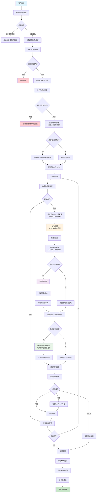

```mermaid
flowchart TD
    A[程序启动] --> B[解析命令行参数]
    B --> C{参数检查}
    C -->|缺少模型路径| D[显示用法说明并退出]
    C -->|参数正确| E[初始化信号处理器]
    
    E --> F[分析输入源类型]
    F --> G{输入源类型}
    G -->|数字| H[摄像头ID模式]
    G -->|设备路径| I[摄像头设备路径模式]
    G -->|文件路径| J[视频文件模式]
    
    H --> K[加载RKNN模型]
    I --> K
    J --> K
    
    K --> L{模型加载成功?}
    L -->|失败| M[错误退出]
    L -->|成功| N[初始化零拷贝内存]
    
    N --> O[打开输入源]
    O --> P{输入源打开成功?}
    P -->|失败| Q[错误退出]
    P -->|成功| R[设置输入参数<br/>1920x1080 MJPEG]
    
    R --> S[初始化ROI结果结构]
    S --> T[主循环开始]
    
    T --> U[读取输入帧]
    U --> V{读取成功?}
    V -->|失败| W[检查退出信号]
    V -->|成功| X[零拷贝letterbox预处理<br/>直接写入NPU内存]
    
    X --> Y[NPU推理<br/>篮筐篮球检测]
    Y --> Z[DFL解码后处理<br/>基于modern_dual_comparator.py逻辑]
    Z --> AA[NMS非极大值抑制]
    
    AA --> BB[分类检测结果]
    BB --> CC{检测到篮筐?}
    CC -->|是| DD[记录篮筐位置和置信度]
    CC -->|否| EE[标记无篮筐]
    
    DD --> FF{检测到篮球?}
    EE --> FF
    FF -->|是| GG[记录篮球位置和置信度]
    FF -->|否| HH[标记无篮球]
    
    GG --> II[ROI空间关系分析]
    HH --> II
    
    II --> JJ{同时检测到篮筐和篮球?}
    JJ -->|是| KK[计算中心点距离]
    JJ -->|否| LL[跳过距离计算]
    
    KK --> MM[判断空间位置关系<br/>上下左右相对位置]
    MM --> NN[绘制连接线]
    
    LL --> OO[绘制检测框]
    NN --> OO
    
    OO --> PP[绘制类别标签和置信度]
    PP --> QQ[绘制ROI分析信息]
    QQ --> RR[显示统计信息<br/>检测计数、FPS等]
    
    RR --> SS[显示实时画面]
    SS --> TT[检查按键输入]
    TT --> UU{按键处理}
    UU -->|ESC键| VV[设置退出标志]
    UU -->|S键| WW[截图保存]
    UU -->|其他| XX[继续循环]
    
    WW --> XX
    XX --> W
    W --> YY{退出信号?}
    YY -->|否| T
    YY -->|是| ZZ[清理资源]
    
    VV --> ZZ
    ZZ --> AAA[释放NPU内存]
    AAA --> BBB[释放RKNN模型]
    BBB --> CCC[关闭输入源]
    CCC --> DDD[程序正常退出]
    
    style A fill:#e1f5fe
    style DDD fill:#c8e6c9
    style M fill:#ffcdd2
    style Q fill:#ffcdd2
    style Y fill:#fff3e0
    style II fill:#f3e5f5
    style KK fill:#e8f5e8
    style WW fill:#fff9c4
```

# YOLOv8篮球姿态检测系统 - 程序流程图

本文档展示了项目中两个核心检测程序的详细流程图，帮助开发者理解系统架构和数据流。

## 目录
1. [yolov8_pose_only - 纯姿态检测程序](#yolov8_pose_only---纯姿态检测程序)
2. [rim_basketball_detector_v2 - 篮筐篮球检测程序](#rim_basketball_detector_v2---篮筐篮球检测程序)

---

## yolov8_pose_only - 纯姿态检测程序

### 程序概述
- **功能**: 专注于人体姿态检测和多目标跟踪
- **源码**: `src/pose_main.cc`
- **模型**: `Q_yolov8_pose.rknn`
- **架构**: 单线程 + NPU零拷贝优化
- **特性**: ByteTrack跟踪 + Homography坐标映射

### 详细流程图

### 关键技术点说明

1. **零拷贝优化**: 预处理数据直接写入NPU内存，避免CPU-NPU数据传输开销
2. **ByteTrack跟踪**: 实时多目标跟踪，为每个检测到的人分配唯一ID
3. **Homography映射**: 将图像坐标转换为真实世界坐标，用于空间定位
4. **ROI地面定位**: 计算检测框底边中点作为人员地面位置参考

---

## rim_basketball_detector_v2 - 篮筐篮球检测程序

### 程序概述
- **功能**: 专门检测篮筐和篮球，分析空间关系
- **源码**: `src/rim_basketball_detector_updated.cc`
- **模型**: `Q_Rim_Basketball_724_JZ.rknn`
- **架构**: 单线程 + NPU零拷贝优化
- **特性**: ROI分析 + 距离计算 + 空间关系判断

### 详细流程图

### 关键技术点说明

1. **DFL解码**: 基于Distribution Focal Loss的边界框回归，提高检测精度
2. **ROI分析**: 分析篮筐和篮球的空间关系，计算相对位置和距离
3. **modern_dual_comparator验证**: 后处理逻辑经过Python参考实现验证，确保准确性
4. **多输入源支持**: 支持摄像头设备、设备路径和视频文件输入

---

## 系统架构对比

| 特性 | yolov8_pose_only | rim_basketball_detector_v2 |
|------|------------------|----------------------------|
| **检测目标** | 人体姿态（17个关键点） | 篮筐和篮球（2类目标） |
| **跟踪功能** | ByteTrack多目标跟踪 | 无跟踪（专注检测） |
| **坐标映射** | Homography世界坐标转换 | ROI空间关系分析 |
| **优化技术** | NPU零拷贝 | NPU零拷贝 |
| **后处理** | 关键点解析 | DFL解码 + NMS |
| **实时功能** | 实时跟踪和坐标显示 | 实时ROI分析和统计 |
| **默认摄像头** | /dev/video0 | /dev/video2 |

## 使用建议

1. **调试单个功能时**: 使用独立的单程序进行调试
2. **完整系统运行**: 使用 `dual_camera_detector` 双摄像头集成版本
3. **性能测试**: 观察NPU内存使用和FPS统计信息
4. **参数调优**: 根据实际场景调整置信度阈值和NMS参数

---
*本文档生成时间: 2025-08-06*  
*基于源码版本: e8fc994*